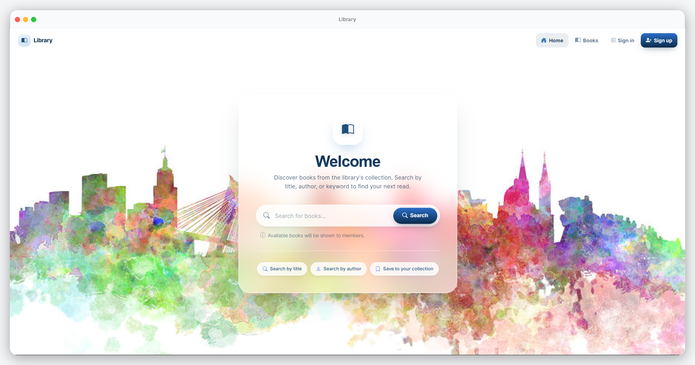

# Library Management System


Library Management System is a Flask application for managing a library's
books, members, and reservations, backed by MySQL.



## Release v2.0

Version 2.0 updates the application for Python 3.14 and Flask 3.1, reorganizes
the Flask code into MVC-focused packages, and redesigns and deduplicates the
site's templates and frontend assets.

- Pins the Flask, Werkzeug, database, mail, and scheduler dependencies in
  `requirements.txt`. Flask routes import `escape` from MarkupSafe for
  compatibility with current Flask releases.
- Updates the Docker image to Python 3.14 and configures the Flask application
  package as the entry point.
- Organizes application code under `app/`: models, database access, managers,
  controllers, extensions, utilities, and background tasks.
- Extracts repeated Jinja markup, page styles, profile tabs, and book-image
  uploader behavior into reusable macros, stylesheets, and JavaScript modules.
- Self-hosts frontend libraries and fonts as separate local assets, avoiding
  runtime CSS and JavaScript requests to third-party CDNs.
- Adds a public-navbar shortcut to the admin dashboard for active admin
  sessions.
- Keeps project screenshots in `docs/screenshots/`.

## Requirements

- Python 3.14
- MySQL 8.x for a local installation, or Docker with Docker Compose

## Run locally on Windows

Creating a virtual environment is recommended, but optional. If you want one,
create and activate it using the commands for your shell:

### Command Prompt (CMD)

```bat
python -m venv .venv
.venv\Scripts\activate.bat
```

### PowerShell

```powershell
python -m venv .venv
.\.venv\Scripts\Activate.ps1
```

To install directly into your current Python environment instead, skip the
virtual-environment commands above. Install the dependencies and create your
environment file using your shell:

**CMD**

```bat
python -m pip install -r requirements.txt
copy .env.example .env
```

**PowerShell**

```powershell
python -m pip install -r requirements.txt
Copy-Item .env.example .env
```

### Linux

```bash
python -m venv .venv
source .venv/bin/activate
python -m pip install -r requirements.txt
cp .env.example .env
```

Edit `.env` and set a unique `SECRET_KEY` and your MySQL connection settings.
Generate a secret key with:

```bash
python -c "import secrets; print(secrets.token_urlsafe(32))"
```

Make sure MySQL is running, and create and initialize the database. On Windows
CMD:

```bat
mysql -u root -p -e "CREATE DATABASE lms;"
mysql -u root -p lms < db\lms.sql
```

On Linux:

```bash
mysql -u root -p -e "CREATE DATABASE lms;"
mysql -u root -p lms < db/lms.sql
```

Set `MYSQL_HOST`, `MYSQL_USER`, `MYSQL_PASSWORD`, and `MYSQL_DB` in `.env` to
match your MySQL installation. The default database name is `lms`.

Start the development server:

**CMD**

```bat
python -m flask --app app run
```

**PowerShell**

```powershell
python -m flask --app app run
```

**Linux**

```bash
python -m flask --app app run
```

Open <http://127.0.0.1:5000/> in your browser. To enable the Flask debugger
and automatic reload during local development, run:

```bash
python -m flask --app app run --debug
```

Flask's CLI loads variables from the project's `.env` file. Alternatively,
set `FLASK_APP=app` in the environment and run `python -m flask run`.

## Run with Docker Compose

Create `.env` from `.env.example`, set `SECRET_KEY`, and provide any needed
application settings. Docker Compose configures `MYSQL_HOST` as the `mysql`
service and initializes a new MySQL data volume from `db/lms.sql`.

Build and start the application:

```powershell
docker compose up --build
```

The application is available at <http://localhost:5000/>. To stop the
containers, press `Ctrl+C`; to stop and remove the containers, run
`docker compose down`. The named MySQL data volume is retained by default.

## Email configuration

Email delivery is configured through the optional SMTP variables in `.env`:

```dotenv
ENABLE_MAILER=True
MAIL_SERVER=smtp.gmail.com
MAIL_PORT=587
MAIL_USERNAME=
MAIL_PASSWORD=
MAIL_USE_TLS=True
MAIL_USE_SSL=
MAIL_DEBUG=1
MAIL_DEFAULT_SENDER=sender@domain.com
```

Configure these values for your SMTP provider before using email-dependent
features. The application uses
[Flask-Mail](https://flask-mail.readthedocs.io/en/latest/).

## Project structure

```text
app/
  controllers/   Flask route handlers
  database/      MySQL connection, DAOs, and repositories
  extensions/    Flask-Mail and APScheduler setup
  managers/      Application service/manager classes
  models/        Actor, admin, book, and user models
  tasks/         Background task entry points
  utils/         Shared helpers
templates/       Jinja templates and shared partials/macros
static/
  css/           Shared layout, component, and page styles
  js/            Reusable page behavior
  vendor/        Locally hosted third-party CSS, JS, and fonts
db/              MySQL initialization script
docs/screenshots/Project screenshots
```
