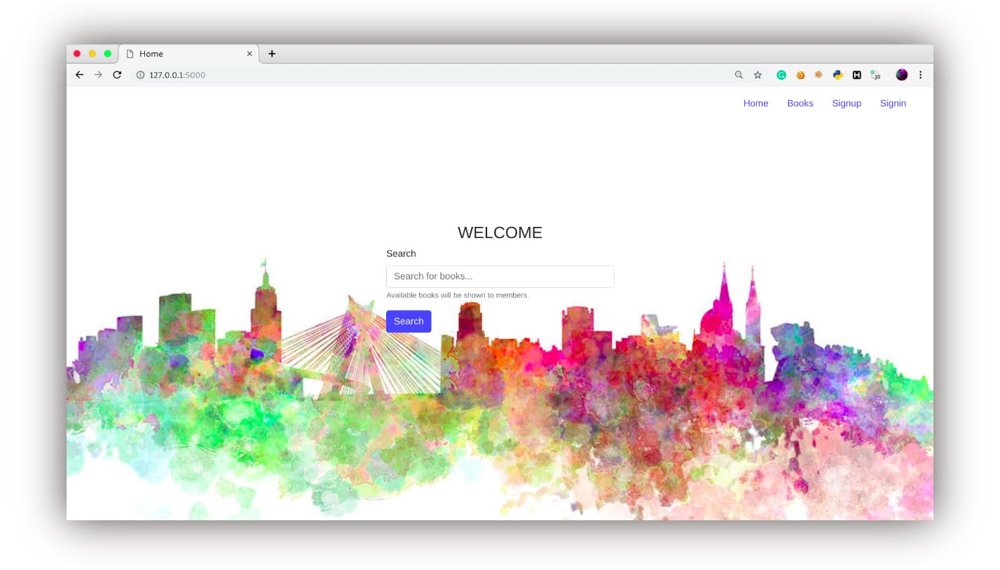

# Library Management System
A simple flask app to manage users along with mysql service now with [docker support](https://github.com/hamza-avvan/library-management-system?tab=readme-ov-file#getting-started-with-docker).



**Youtube Tutorial Walkthrough:** [https://www.youtube.com/watch?v=As90fkeMkyA](https://www.youtube.com/watch?v=As90fkeMkyA)


## Installation

Use Python 3.14 and install the dependencies.

On Windows (PowerShell):
```powershell
py -3.14 -m venv .venv
.\.venv\Scripts\Activate.ps1
python -m pip install -r requirements.txt
```

On macOS or Linux:
```bash
python3.14 -m venv .venv
source .venv/bin/activate
python -m pip install -r requirements.txt
```

## Project structure

Application code lives in the lowercase `app` package, organized around the MVC roles:

- `models/` contains only the actor and book classes.
- `database/` contains the database connection, DAOs, and query repositories.
- `managers/` contains the existing application-level `*Manager` classes.
- `controllers/` contains only the Flask request handlers.
- `extensions/` initializes the Flask mail and scheduler extensions.
- `utils/` contains shared helpers.
- `tasks/` contains background task entry points.

HTML templates are the views and remain in the root `templates/` directory;
static assets remain in `static/`. Project screenshots are kept in
`docs/screenshots/`.

## Set Environment Variables
Replace `.env.example` with `.env` file and update the environment vaiables.
Set `SECRET_KEY` to a unique random value before starting the app. For example, generate one with:
```bash
python -c "import secrets; print(secrets.token_urlsafe(32))"
```

```bash
FLASK_APP=app
FLASK_DEBUG=True

# DB info
MYSQL_HOST=localhost
MYSQL_USER=root
MYSQL_PASSWORD=
MYSQL_DB=lms
```

**Note:** If you update the `MYSQL_DB` variable, remember to also update the corresponding value in the [docker-compose.yaml](https://github.com/hamza-avvan/library-management-system/blob/master/docker-compose.yaml#L12) file to ensure consistency when using Docker. There's an exceptioin for `MYSQL_HOST` which should set set within [docker-compose.yaml](https://github.com/hamza-avvan/library-management-system/blob/master/docker-compose.yaml#L29) file explicitly.

To setup a mail server you can set the below variable in `.env` file. 
```bash
# SMTP credentials
MAIL_SERVER=smtp.gmail.com
MAIL_PORT=587 
MAIL_USERNAME=
MAIL_PASSWORD=
MAIL_USE_TLS=True
MAIL_USE_SSL=
MAIL_DEBUG=1
MAIL_DEFAULT_SENDER=sender@domain.com
```

I'm using Flask-Mail for managing emails. For more information, visit [https://flask-mail.readthedocs.io/en/latest/](https://flask-mail.readthedocs.io/en/latest/)


## Setup Datbase
Export `lms.sql` database from within [db](https://github.com/hamza-avvan/library-management-system/tree/master/db) directory using Phpmyadmin or terminal:

```bash
mysql -u <username> -p <password> lms < lms.sql
```

## Start Server
```bash
flask run
```

Or run this command 
```bash
python -m flask run
```

### Debugging

Start flask with auto reload on code change
```bash
flask run --reload
```
---------------------

# Getting Started with Docker
With this update, you can now easily get an out-of-the-box support for a Docker environment. There's no need to set up a mysql service, import databases, or run multiple commands. 

Create an `.env` file as described in the [Set Environment Variables](https://github.com/hamza-avvan/library-management-system?tab=readme-ov-file#set-environment-variables) section, then execute the `docker-compose` command. This will automate the entire setup process for you.

Build & start the app:
```bash
docker-compose up --build
```

**OR**

Start app (without building):
```bash
docker-compose up
```
