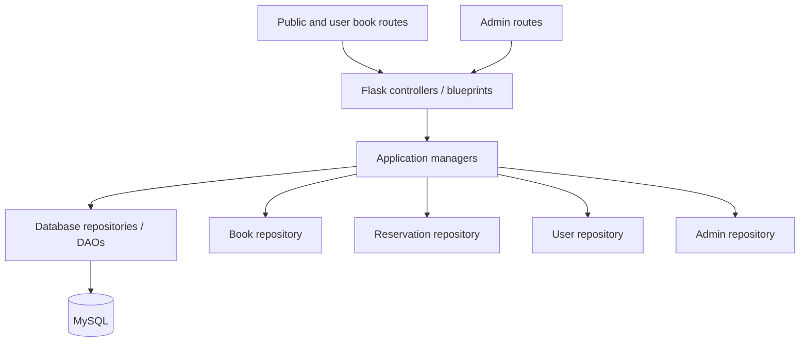

# Application Architecture

This document describes the Flask application's current backend boundaries and the refactoring intended to make features easier to reuse and extend. The design follows separation of concerns: HTTP handling, application workflows, and database access have distinct homes.

## Overview

`app/__init__.py` configures the database, mailer, and scheduler, then registers the public/user and admin blueprints. `DBDAO` creates one repository per data area and exposes them through `DAO.db`.

## Layer Responsibilities

### Controllers

Controllers in `app/controllers/` are Flask adapters. They receive HTTP requests, use the session and route decorators to establish the caller's context, call managers, and choose a response or template.

- `book.py` serves the public catalog and signed-in user's book/reservation pages.
- `admin.py` serves admin workflows, including user and book views.
- `user.py` serves account, sign-in, sign-up, verification, and profile workflows.

A controller belongs to a workflow or access boundary, not necessarily to one database table. Public and admin routes can remain separate while reusing the same managers. This keeps their URLs, templates, and access rules independent without duplicating the underlying book operations.

### Managers

Managers represent application-facing operations and coordinate repositories when a workflow crosses data areas.

- `BookManager` handles catalog operations such as listing, searching, retrieving, and deleting books.
- `ReservationManager` handles reserving a book and retrieving reservations, a user's reserved books, and borrowers for a book.
- `UserManager` handles user records and account operations.
- `AdminManager` handles admin records and sign-in state.

Managers should not construct HTTP responses or contain SQL. Controllers should not need to know which repository or SQL statement implements an operation. When a rule is shared across controllers, it belongs in the relevant manager so each route can use the same behavior.

### Repositories and database access

Repositories in `app/database/` own persistence operations and SQL. `BookDAO`, `UserDAO`, `AdminDAO`, and `ReservationDAO` each focus on one data area. `database.py` provides the MySQL connection/query wrapper; `database_dao.py` wires repository instances together.

For example, reservation-to-book and reservation-to-user queries are in `ReservationDAO`, rather than being exposed as book or user repository methods. This makes the ownership of join queries clear and prevents user/admin managers from reaching into unrelated repositories.

## Reuse and Access Scope

The shared manager does not make the routes share the same permissions:

| Caller/workflow | Reused operation | Access scope |
| --- | --- | --- |
| Public catalog | `BookManager.list()` / `search()` | Publicly visible books |
| Admin catalog | `BookManager.list(availability=0)` / `search(..., 0)` | Admin book view |
| Signed-in user | `ReservationManager` operations | The signed-in user's reservations |
| Admin user/book detail | `ReservationManager` queries | The selected user's books or a book's borrowers |

Route decorators and session-derived identity currently enforce much of this scope. When adding APIs or new workflows, do not treat a request-supplied user ID as proof of permission. Derive the user's own ID from the authenticated session, and protect admin-only routes with the admin authentication decorator. If the same authorization rule is needed in multiple places, centralize it in an application-level authorization/service boundary rather than duplicating checks in controllers.

## Reservation Workflow

A reservation changes two related pieces of data: the book's available-copy count and the reservation row. `ReservationDAO.reserve()` conditionally decrements the count only when it is greater than zero, then inserts the reservation and commits. If the insert or another operation fails, it rolls back and re-raises the error. This prevents a successful reservation from being recorded without the corresponding inventory decrement, and prevents the count from becoming negative through this operation.

Reservation queries use bound SQL parameters for IDs. Other repositories still contain older SQL construction patterns, so parameterization should be applied consistently as those repositories are updated.

The route currently checks for an existing reservation before calling `reserve_for_user()`, but does not handle the manager's `"err_out"` result when no copies are available. A follow-up improvement is to make reservation validation and outcome handling an explicit application workflow, then let the controller translate its result into a message or response.

## Adding or Extending a Feature

1. Add or extend the repository method that owns the required database operation. Keep SQL and row fetching in the repository.
2. Add a manager method for the application operation. Put multi-repository coordination and reusable business rules here.
3. Call the manager from the relevant controller. Keep request parsing, authentication decorators, and response selection in the controller.
4. Reuse an existing manager when the operation has the same responsibility. Add a new manager only when it represents a distinct workflow or business responsibility, not merely because a new route or table exists.
5. Add focused tests for the manager/repository behavior and route permissions when a test suite is introduced.

For example, an admin book route and a public book route should both use `BookManager` for catalog operations. If both need reservation data, they should use `ReservationManager`; neither should query the other manager's repository directly.

## What This Refactor Improves

- **Single responsibility:** catalog, reservation, account, and admin persistence/workflows have clearer owners.
- **Reuse:** public/user and admin controllers call the same book and reservation managers instead of duplicating database operations.
- **Change isolation:** SQL changes for reservations are localized to `ReservationDAO`; route/template changes need not rewrite those queries.
- **Safer inventory updates:** the reservation count update is conditional and committed with its reservation insert, with rollback on failure.
- **Simpler extension:** a new route can reuse a manager without adding cross-entity methods to unrelated managers.

These are primarily maintainability and correctness improvements, not a claim of measured runtime speedup. There is currently no repository test suite, and the database transaction behavior should be verified against the configured MySQL environment.

## Follow-up Boundaries

The refactor establishes clearer ownership, but it does not yet move every business rule out of controllers. The duplicate-reservation check and handling of an unavailable-book result should move into the reservation workflow. Session and authentication behavior also still live on the `Actor` model; separating authentication/session concerns from data models can be considered independently. These follow-ups can be introduced incrementally without changing the controller/manager/repository direction described above.
