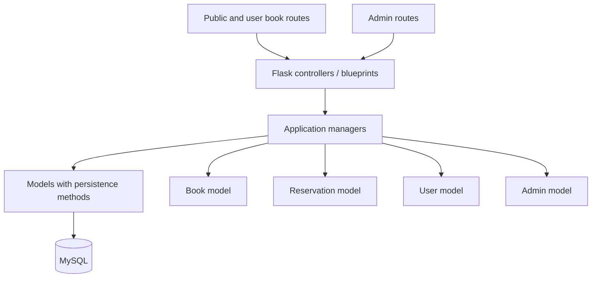

# Application Architecture

This document describes the Flask application's current backend boundaries. The application uses an Active Record-style model design: model classes own entity-specific SQL operations, while managers coordinate application workflows and controllers handle HTTP concerns.

## Overview

`app/__init__.py` configures the database, mailer, and scheduler, then registers the public/user and admin blueprints. `DAO` creates one model instance per data area and exposes them directly as `dao.book`, `dao.user`, `dao.admin`, and `dao.reservation`.

## Layer Responsibilities

### Controllers

Controllers in `app/controllers/` are Flask adapters. They receive HTTP requests, apply route decorators from the authentication context, call managers, and choose a response or template.

- `book.py` serves the public catalog and signed-in user's book/reservation pages.
- `admin.py` serves admin workflows, including user and book views.
- `user.py` serves account, sign-in, sign-up, verification, and profile workflows.

A controller belongs to a workflow or access boundary, not necessarily to one database table. Public and admin routes can remain separate while reusing the same managers. This keeps their URLs, templates, and access rules independent without duplicating the underlying book operations.

### Managers

Managers represent application-facing operations and coordinate model operations when a workflow crosses data areas.

- `BookManager` handles catalog operations such as listing, searching, retrieving, and deleting books.
- `ReservationManager` handles reserving a book and retrieving reservations, a user's reserved books, and borrowers for a book.
- `UserManager` handles user records and account operations.
- `AdminManager` handles admin records and sign-in state.

Managers should not construct HTTP responses. SQL lives on the model objects in this design, not in managers or controllers. When a rule is shared across controllers, it belongs in the relevant manager so each route can use the same behavior.

### Models and database access

`Book`, `User`, `Admin`, and `Reservation` in `app/models/` own persistence methods for their corresponding data. They do not own Flask session or route-authentication behavior.

`database.py` provides the MySQL connection/query wrapper. `dao.py` constructs all model instances with the same stateless adapter. This is an Active Record-style compromise: persistence methods are close to the entity, but models consequently depend on the database layer. Reservation-to-book and reservation-to-user queries live on `Reservation` because they operate on reservation records.

`app/authentication/base.py` defines shared `BaseAuthContext` behavior. The child package `app/authentication/contexts/` contains role-specific subclasses in `admin.py` and `user.py`, each defining its session key, redirect prefix, and session fields. `UserManager` and `AdminManager` instantiate the appropriate subclass. Controllers use these contexts on the routes that need them; authentication is not applied globally as middleware.

## Reuse and Access Scope

The shared manager does not make the routes share the same permissions:

| Caller/workflow | Reused operation | Access scope |
| --- | --- | --- |
| Public catalog | `BookManager.list()` / `search()` | Publicly visible books |
| Admin catalog | `BookManager.list(availability=0)` / `search(..., 0)` | Admin book view |
| Signed-in user | `ReservationManager` operations | The signed-in user's reservations |
| Admin user/book detail | `ReservationManager` queries | The selected user's books or a book's borrowers |

Route decorators and session-derived identity currently enforce much of this scope. When adding APIs or new workflows, do not treat a request-supplied user ID as proof of permission. Derive the user's own ID from the authenticated session, and protect admin-only routes with the admin authentication decorator. If the same authorization rule is needed in multiple places, centralize it in an application-level authorization/service boundary rather than duplicating checks in controllers.

## Reservation Workflow

A reservation changes two related pieces of data: the book's available-copy count and the reservation row. `Reservation.reserve()` conditionally decrements the count only when it is greater than zero, then inserts the reservation and commits. If the insert or another operation fails, it rolls back and re-raises the error. This prevents a successful reservation from being recorded without the corresponding inventory decrement, and prevents the count from becoming negative through this operation.

Model queries use fixed table names and bound parameters for values. The database adapter has no mutable table-selection state, so all models can safely share the same adapter instance.

The route currently checks for an existing reservation before calling `reserve_for_user()`, but does not handle the manager's `"err_out"` result when no copies are available. A follow-up improvement is to make reservation validation and outcome handling an explicit application workflow, then let the controller translate its result into a message or response.

## Adding or Extending a Feature

1. Add or extend a model method for the entity's database operation. Keep SQL and row fetching out of managers and controllers.
2. Add a manager method for the application operation. Put multi-model coordination and reusable business rules here.
3. Call the manager from the relevant controller. Keep request parsing, authentication decorators, and response selection in the controller.
4. Reuse an existing manager when the operation has the same responsibility. Add a new manager only when it represents a distinct workflow or business responsibility, not merely because a new route or table exists.
5. Add focused tests for model persistence, manager behavior, and route permissions when a test suite is introduced.

For example, an admin book route and a public book route should both use `BookManager` for catalog operations. If either needs reservation data, it should use `ReservationManager`; managers should not reach into each other's model dependencies.

## What This Refactor Improves

- **Clearer ownership:** catalog, reservation, account, and admin persistence methods are grouped with their corresponding models; workflow coordination remains in managers.
- **Reuse:** public/user and admin controllers call the same book and reservation managers instead of duplicating database operations.
- **Change isolation:** SQL changes for reservations are localized to the `Reservation` model; route/template changes need not rewrite those queries.
- **Safer inventory updates:** the reservation count update is conditional and committed with its reservation insert, with rollback on failure.
- **Simpler extension:** a new route can reuse a manager without adding cross-entity methods to unrelated managers.

These are primarily maintainability and correctness improvements, not a claim of measured runtime speedup. There is currently no test suite, and the database transaction behavior should be verified against the configured MySQL environment.

## Follow-up Boundaries

The model-centered structure reduces file indirection but intentionally combines domain and persistence responsibilities. The duplicate-reservation check and handling of an unavailable-book result should move into the reservation workflow. Managers also still receive the full DAO container; narrowing their dependencies is a useful follow-up. Session/authentication behavior is separated into `AuthContext`, while route-specific decorators remain explicit in the controllers.
